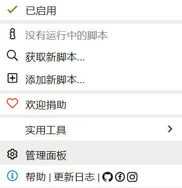

## 长江雨课堂刷课脚本（2023.03.08更新，合并为一个脚本，通用支持长江雨课堂中的所有课程）

基于以下脚本进行修改而来：
[长江雨课堂刷课](https://greasyfork.org/zh-CN/scripts/434531-%E9%95%BF%E6%B1%9F%E9%9B%A8%E8%AF%BE%E5%A0%82%E5%88%B7%E8%AF%BE
)
[scnu华南师范大学网课脚本](https://greasyfork.org/zh-CN/scripts/452433-scnu%E5%8D%8E%E5%8D%97%E5%B8%88%E8%8C%83%E5%A4%A7%E5%AD%A6%E7%BD%91%E8%AF%BE%E8%84%9A%E6%9C%AC
)

## **更新后只需要此一个脚本，请先删除以前的所有脚本**
### 1.安装**Tampermonkey**

https://www.tampermonkey.net/

将油猴脚本安装到你的浏览器中（不会可以搜搜教程）

### 2.下载脚本

下载repository里的压缩包，解压，主要使用两个".js"文件

长江雨课堂刷课for_SCUT.user.js----用于自动跳转  

### 3.导入脚本

点击浏览器右上角油猴Tampermonkey图标

点击管理面板

右上角选择实用工具

在导入中选择文件进行导入，依次脚本进行导入即可

### 4.成功后效果

成功导入后进入雨课堂对应课程链接，将自动进行跳转播放

再次点击油猴脚本图标会显示脚本正在运作

### 5.进入课程使用

在长江与课堂中，进入对应课程，再**点击刷新**即可使用

#### bug

进入视频时可能静音会由一点点延迟

在视频后面如果存在图文会卡住，但加入了自动刷新，在1min后会自动继续

90%的问题可以使用刷新解决（